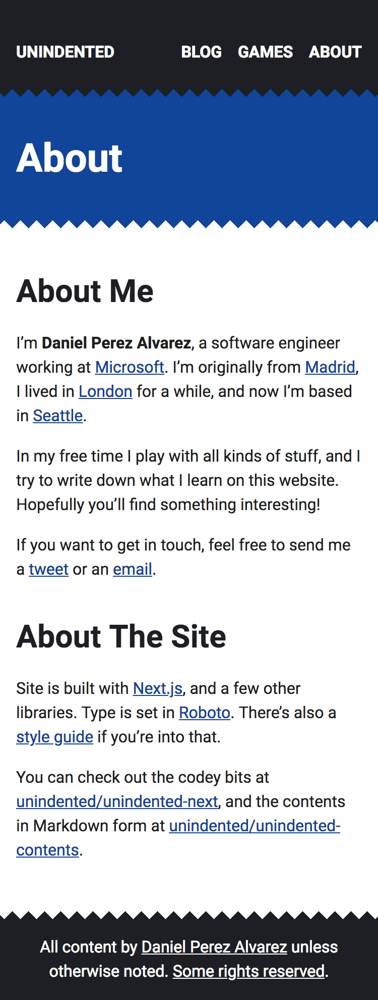

# Unindented (Website) [](https://travis-ci.org/unindented/unindented-next)

This is the source code for my website, [unindented.org](https://unindented.org/).



The contents themselves are versioned separately as a submodule. You can find them at <https://github.com/unindented/unindented-contents>.

## Install

If you have [Node.js](https://nodejs.org/) installed on your system, just run:

```
$ npm install
```

## Develop

To develop the site, do:

```
$ npm run start
```

## Build

To build the site, do:

```
$ npm run export
```

## Deploy

To deploy the site to the `development` environment, do:

```
$ npm run deploy:dev
```

To deploy the site to the `production` environment, do:

```
$ npm run deploy:prod
```

## Meta

- Code: `git clone https://github.com/unindented/unindented-next.git`
- Home: <https://unindented.org/>

## Contributors

Daniel Perez Alvarez ([unindented@gmail.com](mailto:unindented@gmail.com))

## License

Copyright (c) 2018 Daniel Perez Alvarez ([unindented.org](https://unindented.org/)). This is free software, and may be redistributed under the terms specified in the LICENSE file.
